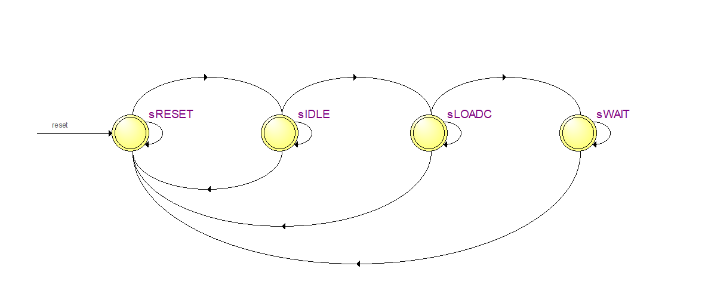

# Convolution Accelerator VLSI
Optional Project for the course VLSI in the 8th semester of University. The purpose behind it was to build a project in system verilog that applies a convolution of a specific filter to an image. Currently only positive (all the numbers of the filter) filters are supported. There are two versions, one without pipeline and one with. 
Every version corresponds to one folder which has the following directories/files:
* **Correct Images:** Folder containing the expected results (made with matlab)
* **Filtered Images:** The results made by the current project
* **Images:** Folder containg the images we used for the results
* **Testbenches:** To make sure the modules work
* **work:** Folder library made by ModelSim software
* **sv Files:** Modules of the project, made in System Verilog

Images are given to the project by first converting the image to the corresponding values in decimal. The project also results the image in decimals in a .txt format so we must do the inverse conversion again. The path for the input .txt image (image for convolution) and the outputs path for the .txt file (convoluted image) are in the **convolution_filter_module_tb.sv** which is the file you want to run in the ModelSim to recreate the results.

## Modules ##
### Control Module ###
The Control Module is responsible for loading the coefficients of the 3x3 filter kernel we will apply to the image. As said before, the project currently supports only positive coefficients (negative ones will be added to next version probably).

